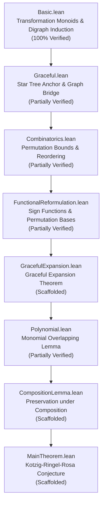

# 🌳 Kotzig–Ringel–Rosa (KRR) Conjecture

<p align="center">
  
</p>

<p align="center">
  <b>Formal Verification of the Graceful Tree Conjecture in Lean 4</b><br/>
  <i>A rigorous verification effort based on the functional reformulation by Gnang (2022).</i>
</p>

<p align="center">
  <a href="https://github.com/Doublew08/KRR/actions"></a>
  
  
  
</p>

---

## 🏛️ Project Principles

- **Strict "No-Sorry" Mandate**: No code is merged into `master` unless every lemma is fully verified. We prioritize logical integrity over rapid scaffolding.
- **Mathlib-Native Design**: We leverage `Mathlib.Combinatorics.SimpleGraph`, `Mathlib.Data.MvPolynomial`, and `Mathlib.GroupTheory.Perm.Basic` to ensure our proofs are idiomatic and extensible.
- **Functional Clarity**: We model trees as endofunctions $\mathbb{Z}_n \to \mathbb{Z}_n$, providing a unique algebraic lens on a classical graph theory problem.

## 🧬 Proof Architecture

This project follows a 7-phase verification roadmap, driving any tree toward a star tree via functional composition.



## 📜 Key Formalized Statements

### The KRR Conjecture
The final goal of this project is the formal proof that every tree admits a graceful labeling.
```lean
theorem KRR_Conjecture (G : SimpleGraph V) [Fintype V] [DecidableRel G.Adj] :
    G.IsTree → IsGraceful G
```

### The Functional Bridge
We bridge the functional model to classical graph theory, proving that our algebraic conditions are equivalent to the graph-theoretic ones.
```lean
theorem isGraceful_bridge (f : Fin n → Fin n) (h_tree : IsTreeFunction f) :
    isGraceful'' f ↔ G.IsGraceful 
```

## 📊 Verification Status

| Phase | Module | Status | Sorries | Key Achievements & Formalized Statements |
| :---: | :--- | :---: | :---: | :--- |
| 1 | [`Basic.lean`](file:///c:/Math/KRR/KRR/Basic.lean) | ✅ Verified | 0 | **Foundational definitions & induction.** Defined transformation monoids, functional digraphs, canonical tree functions, and proved that every canonical tree function is a tree function. Proved that rooted trees reach their root in $\leq N$ steps. |
| 2 | [`Graceful.lean`](file:///c:/Math/KRR/KRR/Graceful.lean) | 🚧 In Progress | 2 | **Graceful labelings and star trees.** Proved star trees (constant functions) are graceful. Proved the Bridge Theorem linking functional gracefulness to graph gracefulness. *Remaining: Iterative Descent ($f^2$ graceful $\implies f$ graceful), and non-star induction step.* |
| 3 | [`Combinatorics.lean`](file:///c:/Math/KRR/KRR/Combinatorics.lean) | 🚧 In Progress | 3 | **Permutation bounds.** Proved the reordering lemma for permutation bounds. *Remaining: product formulas and cardinality bounds for restricted permutations.* |
| 3b | [`FunctionalReformulation.lean`](file:///c:/Math/KRR/KRR/FunctionalReformulation.lean) | 🚧 In Progress | 1 | **Algebraic sign function.** Defined the sign function $s_f(\gamma, i)$ and permutation basis condition. *Remaining: counting valid permutation bases.* |
| 4 | [`GracefulExpansion.lean`](file:///c:/Math/KRR/KRR/GracefulExpansion.lean) | 🔲 Scaffolded | 2 | **Graceful Expansion Theorem.** Defined the statement of the expansion: $\sigma(f(i)) = \sigma(i) + s_f \cdot \gamma(\sigma(i))$. *Remaining: full expansion proof.* |
| 5 | [`Polynomial.lean`](file:///c:/Math/KRR/KRR/Polynomial.lean) | 🚧 In Progress | 1 | **Determinantal polynomial machinery.** Proved basis expansion and the Monomial Overlapping Lemma (showing determinantal polynomial is non-zero). *Remaining: graceful evaluation theorem ($|F_f(\sigma)| = (n-1)!$).* |
| 6 | [`CompositionLemma.lean`](file:///c:/Math/KRR/KRR/CompositionLemma.lean) | 🔲 Scaffolded | 1 | **Complexity preservation.** Defined the composition lemma showing that maximum distinct edge labels is non-increasing under $f \circ f$. *Remaining: proof.* |
| 7 | [`MainTheorem.lean`](file:///c:/Math/KRR/KRR/MainTheorem.lean) | 🔲 Scaffolded | 1 | **Final KRR synthesis.** Defined final theorem: every tree has a graceful labeling. *Remaining: inductive composition chain.* |

## 🛠️ Usage

### Prerequisites
- Install [Lean 4](https://leanprover.github.io/lean4/doc/setup.html) via `elan`.
- Ensure you have `lake` (Lean build system) available.

### Installation & Build
```bash
# Clone the repository
git clone https://github.com/Doublew08/KRR.git
cd KRR

# Download precompiled Mathlib binaries (Highly Recommended)
lake exe cache get

# Build the entire project
lake build
```

## 🤝 Community & Contributing

We coordinate discussions on the **Lean Zulip Chat**. If you are interested in formalizing specific combinatorial bounds or algebraic expansions, please reach out!

- **Source Material**: [Gnang, E. K. (2022). *A proof of the Kotzig–Ringel–Rosa Conjecture*](https://arxiv.org/abs/2202.03178).
- **License**: Apache 2.0.

---
<p align="center">
  <i>"A tree is a function that eventually forgets everything but its root."</i>
</p>
