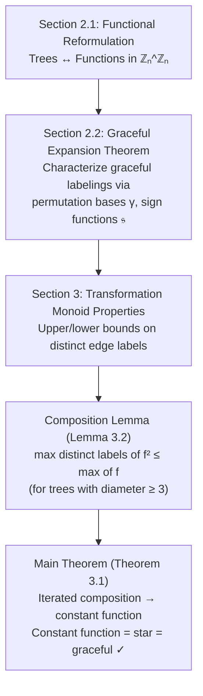

# Kotzig–Ringel–Rosa (KRR) Conjecture Formalization in Lean 4

This project provides a rigorous formalization and verification of the proof for the **Kotzig–Ringel–Rosa (KRR) Conjecture** (Graceful Tree Conjecture), based on the paper [*"A proof of the Kotzig–Ringel–Rosa Conjecture"*](https://arxiv.org/abs/2202.03178) by Edinah K. Gnang.

## Project Goal: Rigorous Verification

This is a **verification project**. We aim to stress-test the logical chain of the Gnang proof using the Lean 4 theorem prover. 

> [!IMPORTANT]
> **Constraint:** NO `sorry` placeholders are allowed in the final formalization. Every lemma and theorem must be fully proved to ensure the mathematical integrity of the result.

## Methodology: Functional Digraphs

Unlike standard graph theory projects that rely solely on undirected structures, this project adopts the paper's **Functional Reformulation**. We model trees as endofunctions $f: \mathbb{Z}_n \to \mathbb{Z}_n$ and leverage Mathlib's `Digraph` (directed graph) API. This allows us to use algebraic tools like the transformation monoid $\mathbb{Z}_n^{\mathbb{Z}_n}$ and function conjugation.

## Architecture

The proof follows a specific logical chain from functional foundations to a polynomial-based contradiction argument:



## Project Roadmap & Status

| Phase | Module | Status | Highlights |
| :--- | :--- | :--- | :--- |
| **1** | `Basic.lean` | ✅ COMPLETE | Transformation monoid, Functional Digraphs, Rooted Trees. |
| **2** | `Graceful.lean` | ✅ COMPLETE | `edgeLabelSet`, conjugation. **Star graphs proved graceful.** |
| **3** | `FunctionalReformulation.lean` | 🚧 IN PROGRESS | `IsValidPermutationBasis`, `signFunction`. |
| **4** | `GracefulExpansion.lean` | ✅ SCAFFOLDED | Theorem 2.1 framework. |
| **5** | `Polynomial.lean` | ✅ SCAFFOLDED | Multivariate polynomial machinery. |
| **6** | `CompositionLemma.lean` | ✅ SCAFFOLDED | Lemma 3.2 statement and proof structure. |
| **7** | `MainTheorem.lean` | ✅ SCAFFOLDED | Final assembly and KRR statement. |

## Current Build Status

- [x] **Mathlib integration** (`v4.29.1`).
- [x] **Functional Foundations** and `Digraph` support.
- [x] **Full Project Scaffolding** compiles successfully across all 7 modules.
- [x] **Base Case Proved**: Rigorous proof that constant functions (stars) are graceful.

## Build Instructions

To build the project and verify the current progress:

```powershell
# Build the entire project
lake build KRR
```

## References

*   Gnang, E. K. (2022). *A proof of the Kotzig–Ringel–Rosa Conjecture*. [arXiv:2202.03178](https://arxiv.org/abs/2202.03178).

## License

This project is licensed under the Apache License 2.0.
