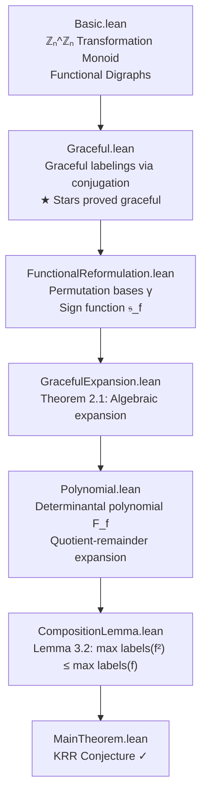

<p align="center">
  
</p>

<h1 align="center">KRR Conjecture — Lean 4 Formalization</h1>

<p align="center">
  A rigorous formal verification of the <strong>Kotzig–Ringel–Rosa (Graceful Tree) Conjecture</strong><br/>
  based on <a href="https://arxiv.org/abs/2202.03178">Gnang (2022)</a>, implemented in Lean 4 with Mathlib.
</p>

<p align="center">
  <a href="https://github.com/Doublew08/KRR/actions"></a>
  
  
  
</p>

---

## Overview

The **Kotzig–Ringel–Rosa (KRR) Conjecture** states that every tree with $m$ edges admits a *graceful labeling*: an injective assignment of labels $\{0, \dots, m\}$ to vertices such that the induced edge labels $|f(u) - f(v)|$ are all distinct and cover $\{1, \dots, m\}$.

This project is a **verification effort**, not just a formalization scaffold. We independently stress-test the logical chain of Gnang's proof using the Lean 4 theorem prover, with a strict **no `sorry`** policy.

The key insight is a *functional reformulation*: trees are modeled as endofunctions $f : \mathbb{Z}_n \to \mathbb{Z}_n$ whose functional digraph is a rooted tree. Graceful labelings then correspond to conjugations $\sigma f \sigma^{-1}$ with $n$ distinct absolute-difference edge labels. The proof proceeds via iterated composition, driving any tree function toward a constant (star) function, which is proved graceful as the base case.

## Proof Architecture



## Status

| Phase | Module | Status | Notes |
| :---: | :--- | :---: | :--- |
| 1 | `Basic.lean` | ✅ Complete | Transformation monoid, functional digraphs, `IsTreeFunction` |
| 2 | `Graceful.lean` | ✅ Complete | `edgeLabelSet`, conjugation, **star graphs proved graceful** |
| 3 | `FunctionalReformulation.lean` | 🚧 In Progress | `IsValidPermutationBasis`, `signFunction` defined; count theorem pending |
| 4 | `GracefulExpansion.lean` | 🔲 Scaffolded | Theorem 2.1 statement in place |
| 5 | `Polynomial.lean` | 🔲 Scaffolded | `MvPolynomial` framework, `F_f` placeholder |
| 6 | `CompositionLemma.lean` | 🔲 Scaffolded | Lemma 3.2 statement in place |
| 7 | `MainTheorem.lean` | 🔲 Scaffolded | Final `KRR_Conjecture` statement |

## Getting Started

**Prerequisites:** [Lean 4](https://leanprover.github.io/) and [elan](https://github.com/leanprover/elan).

```bash
# Clone the repository
git clone https://github.com/Doublew08/KRR.git
cd KRR

# Fetch pre-built Mathlib binaries (saves ~30 min of compilation)
lake exe cache get

# Build the project
lake build KRR
```

## Repository Layout

```
KRR/
├── Basic.lean                    # Transformation monoid & functional digraphs
├── Graceful.lean                 # Graceful labeling definitions & star proof
├── FunctionalReformulation.lean  # Permutation bases (eq. 2.6 in the paper)
├── GracefulExpansion.lean        # Graceful Expansion Theorem (Thm. 2.1)
├── Polynomial.lean               # Multivariate polynomial machinery
├── CompositionLemma.lean         # Composition Lemma (Lemma 3.2)
└── MainTheorem.lean              # Main theorem assembly
```

## Contributing

Contributions are welcome. All contributions must follow the **no `sorry`** mandate — every lemma must be fully proved before merging. Areas where help is most needed:

- Proving `count_valid_bases_eq` (Phase 3 — combinatorial argument)
- Formalizing the determinantal polynomial `F_f` (Phase 5)
- The Composition Lemma contradiction argument (Phase 6)

## Reference

Gnang, E. K. (2022). *A proof of the Kotzig–Ringel–Rosa Conjecture*. [arXiv:2202.03178](https://arxiv.org/abs/2202.03178).

## License

Released under the [Apache 2.0 License](LICENSE).
