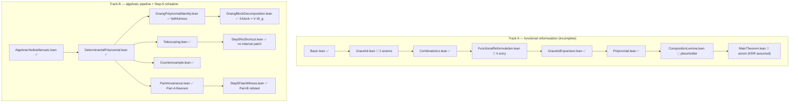

# 🌳 Kotzig–Ringel–Rosa (KRR) Conjecture in Lean 4

<p align="center">
  
</p>

<p align="center">
  <b>A Lean 4 formalization scaffold for the Graceful Tree Conjecture,</b><br/>
  <i>plus a machine-verified analysis of one step of Gnang's (2022) proof.</i>
</p>

<p align="center">
  
  
  
  
  
  
</p>

---

## TL;DR

This repository contains:

1. **A formalization scaffold (Track A + B)** for Gnang's functional-reformulation
   approach to the Kotzig–Ringel–Rosa conjecture. This is an *incomplete proof
   attempt* — it still relies on `sorry`s and auxiliary `axiom`s and **does not
   prove KRR**. The conjecture remains **open** here.

2. **A machine-verified theorem** (axiom-free, `sorry`-free): the *transposition
   invariance* used in Step 5 of Gnang's Composition Lemma (arXiv:2202.03178 v3,
   lines 2066–2079) is **correct** — a graph automorphism of `G_g` fixes the
   determinantal polynomial `P_g`. See [`KRR/PartAInvariance.lean`](KRR/PartAInvariance.lean).

3. **A machine-checked refutation of Step 5's contradiction.** Part B (lines
   2129–2174) concludes `τ ∉ Aut(canonical rep of P_g)` (line 2173). We prove, in
   Gnang's own canonical-representative language, that under Step 5's own premise
   (`g` graceful) the canonical representative of `P_g` is a **nonzero
   `τ`-invariant** polynomial — exactly the object Part B declares impossible. So
   the contradiction is spurious. See
   [`KRR/Step5FlawWitness.lean`](KRR/Step5FlawWitness.lean)
   (`partB_2173_false_canonical`). This is a gap in the **proof**, not a
   counterexample to KRR (none can exist — see *Scope*).

4. **Faithfulness certificates + a no-shortcut theorem.** That our `P_f` is
   Gnang's polynomial is itself proved, not assumed:
   [`KRR/GnangPolynomialIdentity.lean`](KRR/GnangPolynomialIdentity.lean) shows
   `fullDeterminantalPolynomial = F_f` (his gracefulness criterion, paper line
   1006) and matches his binomial/telescoping form;
   [`KRR/GnangBlockDecomposition.lean`](KRR/GnangBlockDecomposition.lean) shows his
   three index-blocks reassemble into `V·W_g` (`fullDet_slide_three_blocks`).
   [`KRR/Step5NoShortcut.lean`](KRR/Step5NoShortcut.lean) shows the framework is
   *consistent* under the premise (`R_{f,g}∉I` is provably true), so no
   contradiction internal to it exists.

> ⚠️ **What is and isn't proved.** `krr_conjecture_main` in
> [`MainTheorem.lean`](KRR/MainTheorem.lean) is an **`axiom`** (assumed), not a
> theorem. The only fully verified mathematical claim of independent interest is
> the Part-A transposition invariance in Track B.

---

## Step 5: what is verified, and where the proof's gap is

The **Kotzig–Ringel–Rosa conjecture** (1967) states that every tree admits a
*graceful labeling*: an injective vertex-labeling into `{0,…,|E|}` whose induced
edge weights `|f(u)−f(v)|` are all distinct. Gnang (2022) models trees as
endofunctions `f : ℤₙ → ℤₙ` and reduces KRR to a *Composition Lemma*. Its
hardest step (Step 5) is a proof by contradiction:

- **Part A (verified correct).** The premise forces the transposition
  `τ = (f(n−1), n−1)` into `Aut(P_g)`. Read correctly, `τ` is a graph
  automorphism of `G_g`: the slide construction makes `f(n−1)` and `n−1`
  *sibling leaves* of `G_g` (common parent `f²(n−1)`). A graph automorphism fixes
  `P_g = V·W_g`, because `W_g = ∏_{i<j}(eⱼ−eᵢ)` is the Vandermonde in the squared
  edge-weights `eₖ = (X_{g k} − X_k)²`, and an automorphism permutes the `eₖ`; the
  two sign flips of `V` and `W_g` cancel. **This is `rename_fullDet_eq_of_aut`.**

- **Part B (refuted, machine-checked).** Gnang then argues (lines 2129–2174, via
  the Monomial Support Lemma and complementary-labeling symmetry) that
  `τ ∉ Aut(canonical rep of P_g)` (line 2173), to contradict Part A. But Part A is
  a *theorem*: `rename τ P_g = P_g` exactly, so `τ ∈ Aut(P_g)`, and since the grid
  ideal is permutation-stable (`rename_mem_gridIdeal`), `rename` commutes with
  grid-reduction, so `τ ∈ Aut(canonical rep)`. We make this fully formal:
  `partB_2173_false_canonical` proves that under the premise (`g` graceful) the
  canonical representative of `P_g` is `τ`-invariant **and nonzero** — exactly the
  configuration line 2173 declares impossible. The Option-3 "symmetry-broadening
  cancellation" Gnang dismisses is exactly the Vandermonde sign cancellation that
  *does* make `τ` an automorphism.

Consequently Gnang's contradiction is between a correct Part A and an incorrect
Part B — it never contradicts the hypothesis `¬graceful(f)`, so the Composition
Lemma is not established by this argument. Moreover no contradiction *internal* to
the framework is available: under the premise, `R_{f,g}∉I` is provably true
(`remainder_not_in_ideal`) and Step 5's target `R_{f,g}∈I` is logically equivalent
to the lemma's own conclusion `P_g∈I` (`remainder_in_ideal_iff_Pg_in_ideal`). A
valid argument would have to establish the Composition Lemma directly. *(We claim a
gap in this proof — not that KRR is false, nor that the lemma has no other proof.)*

```lean
-- Verified: a graph automorphism of G_g fixes P_g (KRR/PartAInvariance.lean)
theorem rename_fullDet_eq_of_aut (g : Fin n → Fin n) (τ : Equiv.Perm (Fin n))
    (hτ : ∀ i, g (τ i) = τ (g i)) :
    MvPolynomial.rename τ (fullDeterminantalPolynomial g) = fullDeterminantalPolynomial g

-- Verified: Gnang's slide makes τ = (f L, L) an automorphism, hence it fixes P_g
theorem rename_fullDet_slide (f : Fin n → Fin n) (L : Fin n)
    (h0 : f (f L) ≠ f L) (hleaf : ∀ i, f i ≠ L) :
    MvPolynomial.rename (Equiv.swap (f L) L) (fullDeterminantalPolynomial (slide f L))
      = fullDeterminantalPolynomial (slide f L)
```

### Scope — no counterexample to KRR exists here

Gnang's contradiction lives in the regime where `f` is **ungraceful**. A
brute-force search of *all* semigroup trees (rooted at `0`, every non-root
pointing nearer the root) finds **zero ungraceful `f`** at `n = 5, 6, 7`
(24/120/720 trees). The Graceful Tree Conjecture holds for all small trees, so
that regime is **empty** for every computable `n`. Hence this gap **cannot** be
turned into a tree counterexample to KRR — it is a flaw in the *proof*, and the
*statement* is plausibly true but unproved by this route.

---

## The Formalization Scaffold (incomplete)

Two tracks. **Track A** is the functional/combinatorial skeleton; **Track B** is
the algebraic-geometry pipeline (grid ideal + determinantal polynomial) the
Part-A theorem lives in.


```mermaid
graph TD
    subgraph TrackA["Track A — functional reformulation (incomplete)"]
      A["Basic.lean ✅"] --> B["Graceful.lean 🚧 2 axioms"]
      B --> C["Combinatorics.lean ✅"]
      C --> D["FunctionalReformulation.lean 🚧 4 sorry"]
      D --> E["GracefulExpansion.lean ✅"]
      E --> F["Polynomial.lean ✅"]
      F --> G["CompositionLemma.lean ⬚ placeholder"]
      G --> H["MainTheorem.lean 🚧 axiom (KRR assumed)"]
    end
    subgraph TrackB["Track B — algebraic pipeline + Step-5 refutation"]
      N["AlgebraicNullstellensatz.lean ✅"] --> P["DeterminantalPolynomial.lean ✅"]
      P --> T["Telescoping.lean ✅"]
      P --> X["PartAInvariance.lean ✅ Part-A theorem"]
      P --> Y["Counterexample.lean ✅"]
      P --> ID["GnangPolynomialIdentity.lean ✅ faithfulness"]
      ID --> BL["GnangBlockDecomposition.lean ✅ 3-block = V·W_g"]
      T --> NS["Step5NoShortcut.lean ✅ no internal patch"]
      X --> FW["Step5FlawWitness.lean ✅ Part-B refuted"]
    end
```

### Verification status

`✅` = no `sorry`/`axiom`; `🚧` = open; `⬚` = intentional statement-only
placeholder.

| Module | Track | Status | Open | Notes |
| :--- | :---: | :---: | :---: | :--- |
| [`Basic.lean`](KRR/Basic.lean) | A | ✅ | — | Transformation monoids, canonical tree functions, root-reachability |
| [`Graceful.lean`](KRR/Graceful.lean) | A | 🚧 | 2 axioms | Star trees graceful; functional↔graph bridge; iterative descent axiomatized |
| [`Combinatorics.lean`](KRR/Combinatorics.lean) | A | ✅ | — | Reordering lemma, product formulas, permutation cardinality bounds |
| [`FunctionalReformulation.lean`](KRR/FunctionalReformulation.lean) | A | 🚧 | 4 sorry | Sign function, permutation-basis condition, valid-basis counting |
| [`GracefulExpansion.lean`](KRR/GracefulExpansion.lean) | A | ✅ | — | Expansion `σ(f(i))=σ(i)+s_f·γ(σ(i))` |
| [`Polynomial.lean`](KRR/Polynomial.lean) | A | ✅ | — | Monomial overlapping lemma; graceful evaluation |
| [`CompositionLemma.lean`](KRR/CompositionLemma.lean) | A | ⬚ | — | Statement-level placeholder; not assumed |
| [`MainTheorem.lean`](KRR/MainTheorem.lean) | A | 🚧 | 1 axiom | KRR target stated as a **placeholder axiom** (assumed, not proved) |
| [`AlgebraicNullstellensatz.lean`](KRR/AlgebraicNullstellensatz.lean) | B | ✅ | — | `P∈I ⟺ P` vanishes on `ℤₙⁿ` (Combinatorial Nullstellensatz) |
| [`DeterminantalPolynomial.lean`](KRR/DeterminantalPolynomial.lean) | B | ✅ | — | `P_f=V·W_f`; `W_f(σ)≠0` iff graceful; `P_f≡0` iff ungraceful |
| [`Telescoping.lean`](KRR/Telescoping.lean) | B | ✅ | — | `R_{f,g}=P_g−P_f`; ideal inheritance |
| [`PartAInvariance.lean`](KRR/PartAInvariance.lean) | B | ✅ | — | **Step-5 Part-A theorem**: graph automorphisms fix `P_g` (axiom-free) |
| [`Step5FlawWitness.lean`](KRR/Step5FlawWitness.lean) | B | ✅ | — | **Step-5 Part-B refuted**: `partB_2173_false_canonical`; grid ideal permutation-stable |
| [`Step5NoShortcut.lean`](KRR/Step5NoShortcut.lean) | B | ✅ | — | `R_{f,g}∈I ⟺ P_g∈I`; no contradiction internal to the framework |
| [`GnangPolynomialIdentity.lean`](KRR/GnangPolynomialIdentity.lean) | B | ✅ | — | Faithfulness: `fullDet = F_f` (paper line 1006) and its binomial form |
| [`GnangBlockDecomposition.lean`](KRR/GnangBlockDecomposition.lean) | B | ✅ | — | Gnang's three index-blocks reassemble into `V·W_g` |
| [`Counterexample.lean`](KRR/Counterexample.lean) | B | ✅ | — | Worked `n=3` evaluation: `R_{f,f²}∉I_grid` |

**Honest summary:** Track A still has **2 axioms** (`Graceful.lean`), **4
`sorry`s** (`FunctionalReformulation.lean`), and the **KRR-target axiom**
(`MainTheorem.lean`) open — this is the incomplete proof *attempt* and does not
prove KRR. Track B is fully proved and **depends only on the three standard
Mathlib axioms** (`propext`, `Classical.choice`, `Quot.sound`; verified via
`#print axioms`) with no `sorry`. It contains the complete Step-5 analysis: the
Part-A invariance theorem, the machine-checked refutation of Part B, the
faithfulness certificates, and the no-shortcut result. None of the Track-A
axioms/`sorry`s are used by the Step-5 results.

---

## Key statements

```lean
-- KRR target: an AXIOM (assumed, NOT proved). KRR remains open in this repo.
axiom krr_conjecture_main (T : SimpleGraph (Fin n)) [DecidableRel T.Adj]
    (h_tree : T.IsTree) : IsGraceful T

-- Grid-ideal characterization (Track B, fully proved)
theorem mem_gridIdeal_iff_eval_zero {n : ℕ} [NeZero n] (P : MvPolynomial (Fin n) ℤ) :
    P ∈ gridIdeal n ↔ ∀ x : Fin n → ℤ, (∀ i, x i ∈ grid n) → MvPolynomial.eval x P = 0

-- Step-5 Part A (Track B, fully proved, axiom-free)
theorem rename_fullDet_eq_of_aut (g : Fin n → Fin n) (τ : Equiv.Perm (Fin n))
    (hτ : ∀ i, g (τ i) = τ (g i)) :
    MvPolynomial.rename τ (fullDeterminantalPolynomial g) = fullDeterminantalPolynomial g
```

---

## Build

```bash
git clone https://github.com/Doublew08/KRR.git && cd KRR
lake exe cache get   # download precompiled Mathlib (recommended)
lake build
```

**Prerequisites:** [Lean 4 / elan](https://leanprover.github.io/lean4/doc/setup.html).
Pinned to Lean `v4.29.1` / Mathlib `v4.29.1`.

---

## References

- E. K. Gnang (2022). [*A proof of the Kotzig–Ringel–Rosa Conjecture*](https://arxiv.org/abs/2202.03178). arXiv:2202.03178.
- N. Alon (1999). *Combinatorial Nullstellensatz*. Combin. Probab. Comput. **8**, 7–29.
- R. Montgomery, A. Pokrovskiy, B. Sudakov (2021). *A proof of Ringel's conjecture*. GAFA **31**, 663–720.
- J. A. Gallian. *A dynamic survey of graph labeling*. Electron. J. Combin., #DS6.

License: Apache 2.0. · Discussion: [Lean Zulip](https://leanprover.zulipchat.com/).
