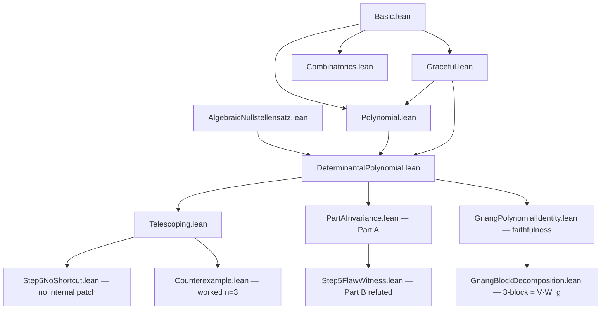

# 🌳 Kotzig–Ringel–Rosa (KRR) Conjecture in Lean 4

<p align="center">
  
</p>

<p align="center">
  <b>A Lean 4 / Mathlib formalization of Gnang's functional-reformulation approach to the</b><br/>
  <i>Graceful Tree Conjecture — an attempt that turned into a machine-checked refutation</i><br/>
  <i>of the contradiction in the proof's Step 5.</i>
</p>

<p align="center">
  <a href="https://github.com/Doublew08/KRR/actions/workflows/lean_action_ci.yml"></a>
  
  
  
</p>

---

## TL;DR

This project began as a Lean 4 formalization of Gnang's functional-reformulation proof of the
Kotzig–Ringel–Rosa conjecture (arXiv:2202.03178 v3). Building the algebraic machinery (grid ideal,
determinantal polynomial, telescoping remainder) to verify the Composition Lemma turned up a
problem in its hardest step (Step 5), and the formalization became a **machine-checked refutation of
that step's contradiction**. Step 5 is a proof by contradiction; we formalize its two halves and
show the contradiction is **spurious**:

1. **Part A is a theorem.** The prescribed transposition `τ` is a genuine graph automorphism of
   `G_g`, so it fixes the determinantal polynomial `P_g` — *unconditionally*
   ([`PartAInvariance.lean`](KRR/PartAInvariance.lean), `rename_fullDet_eq_of_aut`).

2. **Part B's conclusion is false.** Under Step 5's own premise (`g` graceful), the canonical
   representative of `P_g` is a **nonzero `τ`-invariant** polynomial — exactly the object Part B
   (line 2173) declares impossible
   ([`Step5FlawWitness.lean`](KRR/Step5FlawWitness.lean), `partB_2173_false_canonical`).

3. **No internal patch exists.** Under the premise, `R_{f,g} ∉ I` is provably true, and Step 5's
   target `R_{f,g} ∈ I` is logically equivalent to the lemma's own conclusion `P_g ∈ I`
   ([`Step5NoShortcut.lean`](KRR/Step5NoShortcut.lean)). Any valid argument must prove the
   Composition Lemma outright.

Everything compiles against Mathlib and, by `#print axioms`, depends only on the three standard
axioms `propext`, `Classical.choice`, `Quot.sound`; there is **no `sorry` and no custom axiom**.

> **Scope.** This is a gap in *one proof*. We do **not** claim KRR is false, nor that the
> Composition Lemma is false (it is almost certainly true), nor that it cannot prove KRR by other
> means. We analyze v3 (31 Jan 2025), the latest public version.

---

## Step 5: what is verified, and where the proof's gap is

The **Kotzig–Ringel–Rosa conjecture** states that every tree admits a *graceful labeling*: an
injective vertex-labeling into `{0,…,|E|}` whose induced edge weights `|f(u)−f(v)|` are all
distinct. Gnang models trees as endofunctions `f : ℤₙ → ℤₙ` and reduces KRR to a *Composition
Lemma*; its hardest step (Step 5) is a proof by contradiction.

- **Part A (verified correct).** The premise forces the transposition `τ = (f(n−1), v)` into
  `Aut(P_g)`. Read correctly, `τ` is a graph automorphism of `G_g`: the slide construction makes
  `f(n−1)` and the deepest leaf `n−1` *sibling leaves* of `G_g` (common parent `f²(n−1)`). A graph
  automorphism fixes `P_g = V·W_g`, because `W_g = ∏_{i<j}(eⱼ−eᵢ)` is Vandermonde in the squared
  edge-weights `eₖ = (X_{g k} − X_k)²`, an automorphism permutes the `eₖ`, and the two sign flips
  cancel. **This is `rename_fullDet_eq_of_aut`.**

- **Part B (refuted, machine-checked).** Gnang argues (lines 2129–2174, via the Monomial Support
  Lemma and complementary-labeling symmetry) that `τ ∉ Aut(canonical rep of P_g)` (line 2173). But
  Part A gives `rename τ P_g = P_g` exactly, and the grid ideal is permutation-stable
  (`rename_mem_gridIdeal`), so `rename` commutes with grid-reduction and `τ ∈ Aut(canonical rep)`.
  `partB_2173_false_canonical` exhibits, under the premise, a **nonzero `τ`-invariant** canonical
  representative — exactly what line 2173 declares impossible. The Option-3 "symmetry-broadening
  cancellation" Gnang dismisses is precisely the Vandermonde sign cancellation that *does* make `τ`
  an automorphism.

Consequently Gnang's contradiction is between a correct Part A and an incorrect Part B — it never
contradicts the hypothesis `¬graceful(f)`, so the Composition Lemma is not established by this
argument. Moreover no contradiction *internal* to the framework is available: under the premise
`R_{f,g} ∉ I` is provably true (`remainder_not_in_ideal`) and `R_{f,g} ∈ I` is equivalent to the
lemma's own conclusion (`remainder_in_ideal_iff_Pg_in_ideal`).

```lean
-- A graph automorphism of G_g fixes P_g (Part A; KRR/PartAInvariance.lean)
theorem rename_fullDet_eq_of_aut (g : Fin n → Fin n) (τ : Equiv.Perm (Fin n))
    (hτ : ∀ i, g (τ i) = τ (g i)) :
    MvPolynomial.rename τ (fullDeterminantalPolynomial g) = fullDeterminantalPolynomial g

-- Under the premise, P_g's canonical representative is τ-invariant AND nonzero,
-- contradicting Gnang's line 2173 (KRR/Step5FlawWitness.lean)
theorem partB_2173_false_canonical [NeZero n] (g : Fin n → Fin n) (τ : Equiv.Perm (Fin n))
    (hτ : ∀ i, g (τ i) = τ (g i))
    (σ : Equiv.Perm (Fin n)) (hσ : IsAlreadyGraceful (conjugate g σ)) :
    rename τ (fullDeterminantalPolynomial g) - fullDeterminantalPolynomial g ∈ gridIdeal n
      ∧ fullDeterminantalPolynomial g ∉ gridIdeal n
```

### Scope — no counterexample to KRR exists here

Gnang's contradiction lives in the regime where `f` is **ungraceful**. A brute-force search of *all*
semigroup trees (rooted at `0`, every non-root pointing nearer the root) finds **zero ungraceful
`f`** at `n = 5, 6, 7` (24/120/720 trees). So the relevant regime is empty for every small `n`, and
this gap **cannot** be turned into a tree counterexample to KRR. It is a flaw in the *proof*; the
statement is plausibly true but unproved by this route.

---

## What is formalized

All modules below are `sorry`-free and use only the three standard Mathlib axioms.


```mermaid
graph TD
    B["Basic.lean"] --> G["Graceful.lean"]
    B --> C["Combinatorics.lean"]
    B --> Po["Polynomial.lean"]
    G --> Po
    N["AlgebraicNullstellensatz.lean"] --> P["DeterminantalPolynomial.lean"]
    Po --> P
    G --> P
    P --> T["Telescoping.lean"]
    P --> X["PartAInvariance.lean — Part A"]
    P --> ID["GnangPolynomialIdentity.lean — faithfulness"]
    ID --> BL["GnangBlockDecomposition.lean — 3-block = V·W_g"]
    T --> NS["Step5NoShortcut.lean — no internal patch"]
    X --> FW["Step5FlawWitness.lean — Part B refuted"]
    T --> Y["Counterexample.lean — worked n=3"]
```

| Module | Role |
| :--- | :--- |
| [`Basic.lean`](KRR/Basic.lean) | Transformation monoids, canonical tree functions, root-reachability |
| [`Graceful.lean`](KRR/Graceful.lean) | Gracefulness predicates; functional↔graph bridge; star-tree lemma |
| [`Combinatorics.lean`](KRR/Combinatorics.lean) | Reordering lemma, product formulas, permutation bounds |
| [`Polynomial.lean`](KRR/Polynomial.lean) | Monomial overlapping lemma; graceful evaluation |
| [`AlgebraicNullstellensatz.lean`](KRR/AlgebraicNullstellensatz.lean) | `P ∈ I ⟺ P` vanishes on `ℤₙⁿ` (Combinatorial Nullstellensatz) |
| [`DeterminantalPolynomial.lean`](KRR/DeterminantalPolynomial.lean) | `P_f = V·W_f`; `W_f(σ)≠0` iff graceful; `P_f ≡ 0` iff ungraceful |
| [`Telescoping.lean`](KRR/Telescoping.lean) | `R_{f,g} = P_g − P_f`; ideal inheritance |
| [`PartAInvariance.lean`](KRR/PartAInvariance.lean) | **Part A**: graph automorphisms fix `P_g` |
| [`Step5FlawWitness.lean`](KRR/Step5FlawWitness.lean) | **Part B refuted**; grid ideal permutation-stable |
| [`Step5NoShortcut.lean`](KRR/Step5NoShortcut.lean) | `R_{f,g} ∈ I ⟺ P_g ∈ I`; no internal contradiction |
| [`GnangPolynomialIdentity.lean`](KRR/GnangPolynomialIdentity.lean) | Faithfulness: `fullDet = F_f` (paper l.1006) + binomial form |
| [`GnangBlockDecomposition.lean`](KRR/GnangBlockDecomposition.lean) | Gnang's three index-blocks reassemble into `V·W_g` |
| [`Counterexample.lean`](KRR/Counterexample.lean) | Worked `n=3` evaluation: `R_{f,f²} ∉ I_grid` |

---

## Build

```bash
git clone https://github.com/Doublew08/KRR.git && cd KRR
lake exe cache get   # download precompiled Mathlib (recommended)
lake build
```

**Prerequisites:** [Lean 4 / elan](https://leanprover.github.io/lean4/doc/setup.html).
Pinned to Lean `v4.29.1` / Mathlib `v4.29.1`.

---

## References

- E. K. Gnang (2022). [*A proof of the Kotzig–Ringel–Rosa Conjecture*](https://arxiv.org/abs/2202.03178). arXiv:2202.03178.
- N. Alon (1999). *Combinatorial Nullstellensatz*. Combin. Probab. Comput. **8**, 7–29.
- J. A. Gallian. *A dynamic survey of graph labeling*. Electron. J. Combin., #DS6.

License: Apache 2.0.
