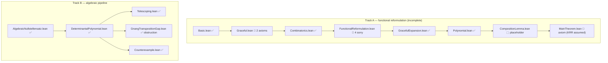

# 🌳 Kotzig–Ringel–Rosa (KRR) Conjecture in Lean 4

<p align="center">
  
</p>

<p align="center">
  <b>A Lean 4 formalization scaffold for the Graceful Tree Conjecture,</b><br/>
  <i>plus a machine-verified obstruction to one step of Gnang's (2022) proof.</i>
</p>

<p align="center">
  <a href="https://github.com/Doublew08/KRR/actions"></a>
  
  
  
  
  
</p>

---

## TL;DR

This repository contains two things, kept deliberately separate:

1. **A formalization scaffold (Track A + B)** for Gnang's functional-reformulation
   approach to the Kotzig–Ringel–Rosa conjecture. This is an *incomplete proof
   attempt*: it still relies on `sorry`s and auxiliary `axiom`s, and **does not
   prove KRR**. The conjecture remains **open** in this repository.

2. **A machine-verified obstruction** (axiom-free, `sorry`-free) showing that the
   *Sibling-Symmetry step* of Gnang's proof (arXiv:2202.03178, §3, lines
   2066–2079) does **not** go through as written, for Gnang's own prescribed
   transposition. See [`KRR/GnangTranspositionGap.lean`](KRR/GnangTranspositionGap.lean).

> ⚠️ **What is and isn't proved.** `krr_conjecture_main` in
> [`MainTheorem.lean`](KRR/MainTheorem.lean) is an **`axiom`** (the target
> statement, *assumed*), not a theorem. The only fully verified mathematical
> claim of independent interest here is the Step-5 obstruction in Track B.

---

## The Step-5 Obstruction (verified result)

The **Kotzig–Ringel–Rosa conjecture** (1967) states that every tree admits a
*graceful labeling*: an injective vertex-labeling with values in
$\{0,\dots,|E|\}$ whose induced edge weights $|f(u)-f(v)|$ are all distinct.
Gnang (2022) models trees as endofunctions $f:\mathbb{Z}_n\to\mathbb{Z}_n$ and
reduces KRR to a *Composition Lemma* whose hardest step is a **Sibling-Symmetry**
argument.

That step claims the transposition $\tau=(f(n{-}1),v)$ with
$v\in f^{-1}(\{f(n{-}1)\})$ permutes the graceful labelings $\Phi(g)$ and so
fixes the canonical representative of $R_{f,g}$ modulo the grid ideal. But
$f^{-1}(\{f(n{-}1)\})$ is the preimage of the **root**, so $\tau$ swaps the
root's label with a **child's** label — a map that need not preserve
gracefulness.

**Witness** ([`GnangTranspositionGap.lean`](KRR/GnangTranspositionGap.lean)):
$f=[1,2,3,3]$ (the path $P_4$), $g=f^2=[2,3,3,3]$, the prescribed $\tau=(2,3)$,
and the graceful labeling $p=[1,3,2,0]$. Then

$$P_g(p) = 51840 \neq 0 = P_g(\tau\cdot p),$$

so $\tau$ sends a graceful labeling to a non-graceful one and
$\mathrm{rename}_\tau P_g \not\equiv P_g \pmod{I_\mathrm{grid}}$. By the
Combinatorial Nullstellensatz this is exactly the failure of the $\tau$-symmetry
the step requires. The theorem `gnang_core_symmetry_false` depends only on the
standard kernel axioms `propext`, `Classical.choice`, `Quot.sound`.

**Scope.** The witness $f$ is itself graceful, so this produces *no* tree
counterexample to KRR — it refutes the **reasoning** of the step, not the
conjecture. Whether the Composition Lemma can be repaired by another route is
open. The brute-force fact that $L(f^2)\le L(f)$ holds for all functional
digraphs up to $n=5$ is unaffected: the gap is in the proof, not (necessarily)
the statement.

```lean
-- Machine-verified obstruction (axiom-free), KRR/GnangTranspositionGap.lean
theorem gnang_core_symmetry_false :
    ¬ ∀ (g : Fin 4 → Fin 4) (τ : Equiv.Perm (Fin 4)),
        MvPolynomial.rename τ (fullDeterminantalPolynomial g) -
        fullDeterminantalPolynomial g ∈ gridIdeal 4
```

---

## The Formalization Scaffold (incomplete)

Two tracks. **Track A** is the functional/combinatorial skeleton; **Track B** is
the algebraic-geometry pipeline (grid ideal + determinantal polynomial) that the
obstruction lives in.


```mermaid
graph TD
    subgraph TrackA["Track A — functional reformulation (incomplete)"]
      A["Basic.lean ✅"] --> B["Graceful.lean 🚧 2 axioms"]
      B --> C["Combinatorics.lean ✅"]
      C --> D["FunctionalReformulation.lean 🚧 4 sorry"]
      D --> E["GracefulExpansion.lean ✅"]
      E --> F["Polynomial.lean ✅"]
      F --> G["CompositionLemma.lean ⬚ placeholder"]
      G --> H["MainTheorem.lean 🚧 axiom (KRR assumed)"]
    end
    subgraph TrackB["Track B — algebraic pipeline"]
      N["AlgebraicNullstellensatz.lean ✅"] --> P["DeterminantalPolynomial.lean ✅"]
      P --> T["Telescoping.lean ✅"]
      P --> X["GnangTranspositionGap.lean ✅ obstruction"]
      P --> Y["Counterexample.lean ✅"]
    end
```

### Verification status

`✅` = no `sorry`/`axiom`; `🚧` = open; `⬚` = intentional statement-only
placeholder.

| Module | Track | Status | Open | Notes |
| :--- | :---: | :---: | :---: | :--- |
| [`Basic.lean`](KRR/Basic.lean) | A | ✅ | — | Transformation monoids, canonical tree functions, root-reachability |
| [`Graceful.lean`](KRR/Graceful.lean) | A | 🚧 | 2 axioms | Star trees graceful; functional↔graph bridge; iterative descent axiomatized |
| [`Combinatorics.lean`](KRR/Combinatorics.lean) | A | ✅ | — | Reordering lemma, product formulas, permutation cardinality bounds |
| [`FunctionalReformulation.lean`](KRR/FunctionalReformulation.lean) | A | 🚧 | 4 sorry | Sign function, permutation-basis condition, valid-basis counting |
| [`GracefulExpansion.lean`](KRR/GracefulExpansion.lean) | A | ✅ | — | Expansion $\sigma(f(i))=\sigma(i)+s_f\cdot\gamma(\sigma(i))$ |
| [`Polynomial.lean`](KRR/Polynomial.lean) | A | ✅ | — | Monomial overlapping lemma; graceful evaluation |
| [`CompositionLemma.lean`](KRR/CompositionLemma.lean) | A | ⬚ | — | Statement-level placeholder; not assumed (see obstruction) |
| [`MainTheorem.lean`](KRR/MainTheorem.lean) | A | 🚧 | 1 axiom | KRR target stated as a **placeholder axiom** (assumed, not proved) |
| [`AlgebraicNullstellensatz.lean`](KRR/AlgebraicNullstellensatz.lean) | B | ✅ | — | $P\in I \iff P$ vanishes on $\mathbb{Z}_n^n$ (Combinatorial Nullstellensatz) |
| [`DeterminantalPolynomial.lean`](KRR/DeterminantalPolynomial.lean) | B | ✅ | — | $P_f=V\cdot W_f$; $W_f(\sigma)\neq0$ iff graceful; $P_f\equiv0$ iff ungraceful |
| [`Telescoping.lean`](KRR/Telescoping.lean) | B | ✅ | — | $R_{f,g}=P_g-P_f$; ideal inheritance |
| [`GnangTranspositionGap.lean`](KRR/GnangTranspositionGap.lean) | B | ✅ | — | **The Step-5 obstruction** (axiom-free) |
| [`Counterexample.lean`](KRR/Counterexample.lean) | B | ✅ | — | Worked $n=3$ evaluation: $R_{f,f^2}\notin I_\mathrm{grid}$ |

**Honest summary:** Track A still has **2 axioms** (`Graceful.lean`), **4
`sorry`s** (`FunctionalReformulation.lean`), and the **KRR-target axiom**
(`MainTheorem.lean`) open. Track B is fully proved and axiom-free, and contains
the verified obstruction.

---

## Key statements

```lean
-- KRR target: an AXIOM (assumed, NOT proved). KRR remains open in this repo.
axiom krr_conjecture_main (T : SimpleGraph (Fin n)) [DecidableRel T.Adj]
    (h_tree : T.IsTree) : IsGraceful T

-- Grid-ideal characterization (Track B, fully proved)
theorem mem_gridIdeal_iff_eval_zero {n : ℕ} [NeZero n] (P : MvPolynomial (Fin n) ℤ) :
    P ∈ gridIdeal n ↔ ∀ x : Fin n → ℤ, (∀ i, x i ∈ grid n) → MvPolynomial.eval x P = 0

-- Step-5 obstruction (Track B, fully proved, axiom-free)
theorem gnang_core_symmetry_false :
    ¬ ∀ (g : Fin 4 → Fin 4) (τ : Equiv.Perm (Fin 4)),
        MvPolynomial.rename τ (fullDeterminantalPolynomial g) -
        fullDeterminantalPolynomial g ∈ gridIdeal 4
```

---

## Build

```bash
git clone https://github.com/Doublew08/KRR.git && cd KRR
lake exe cache get   # download precompiled Mathlib (recommended)
lake build
```

**Prerequisites:** [Lean 4 / elan](https://leanprover.github.io/lean4/doc/setup.html).
Pinned to Lean `v4.29.1` / Mathlib `v4.29.1`.

---

## References

- E. K. Gnang (2022). [*A proof of the Kotzig–Ringel–Rosa Conjecture*](https://arxiv.org/abs/2202.03178). arXiv:2202.03178.
- N. Alon (1999). *Combinatorial Nullstellensatz*. Combin. Probab. Comput. **8**, 7–29.
- R. Montgomery, A. Pokrovskiy, B. Sudakov (2021). *A proof of Ringel's conjecture*. GAFA **31**, 663–720.
- J. A. Gallian. *A dynamic survey of graph labeling*. Electron. J. Combin., #DS6.

License: Apache 2.0. · Discussion: [Lean Zulip](https://leanprover.zulipchat.com/).
