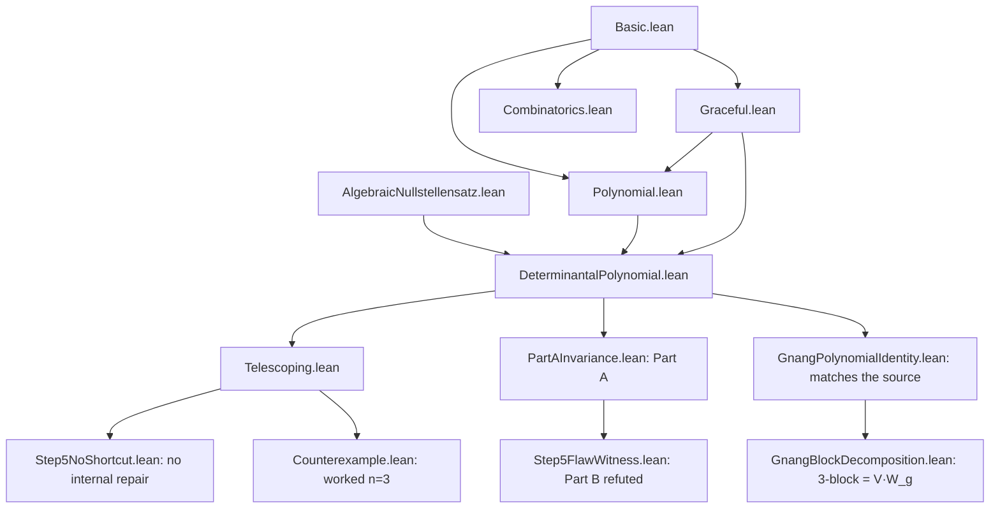

# 🌳 Kotzig–Ringel–Rosa (KRR) Conjecture in Lean 4

<p align="center">
  
</p>

<p align="center">
  <b>A Lean 4 / Mathlib formalization of Gnang's functional-reformulation approach to the</b><br/>
  <i>Graceful Tree Conjecture, which turned into a machine-checked refutation of the</i><br/>
  <i>contradiction in the proof's Step 5.</i>
</p>

<p align="center">
  <a href="https://github.com/Doublew08/KRR/actions/workflows/lean_action_ci.yml"></a>
  
  
  
</p>

---

## TL;DR

This project began as a Lean 4 formalization of Gnang's functional-reformulation proof of the
Kotzig–Ringel–Rosa conjecture (arXiv:2202.03178 v3). While building the algebraic machinery (grid
ideal, determinantal polynomial, telescoping remainder) to check the Composition Lemma, we found a
problem in its hardest step, Step 5, and the formalization became a refutation of that step's
contradiction. Step 5 argues by contradiction. We formalize both halves and show the contradiction
does not hold.

1. The transposition `τ` Gnang prescribes is a graph automorphism of `G_g`, so it fixes the
   determinantal polynomial `P_g`. This needs no extra hypothesis.
   (`rename_fullDet_eq_of_aut`, [`PartAInvariance.lean`](KRR/PartAInvariance.lean))

2. Part B claims `τ` does *not* fix the canonical representative of `P_g`. But under Step 5's own
   premise (`g` graceful) that representative is `τ`-invariant and nonzero, which is the object Part B
   rules out. (`partB_conclusion_false_canonical`, [`Step5FlawWitness.lean`](KRR/Step5FlawWitness.lean))

3. There is no internal repair. Under the premise `R_{f,g} ∉ I` is provably true, and Step 5's target
   `R_{f,g} ∈ I` is equivalent to the lemma's own conclusion `P_g ∈ I`
   ([`Step5NoShortcut.lean`](KRR/Step5NoShortcut.lean)). A valid argument has to prove the Composition
   Lemma directly.

> **Scope.** This is a gap in one proof. We do not claim KRR is false, that the Composition Lemma is
> false, or that the lemma cannot prove KRR by some other route. The analysis is of v3 (31 Jan 2025),
> the latest public version.

---

## Step 5: what is verified, and where the gap is

The Kotzig–Ringel–Rosa conjecture states that every tree admits a *graceful labeling*: an injective
vertex-labeling into `{0,…,|E|}` whose induced edge weights `|f(u)−f(v)|` are all distinct. Gnang
models trees as endofunctions `f : ℤₙ → ℤₙ` and reduces the conjecture to a *Composition Lemma*,
whose hardest step (Step 5) is a proof by contradiction.

**Part A (correct).** The premise puts the transposition `τ = (f(n−1), v)` in `Aut(P_g)`. Read
correctly, `τ` is a graph automorphism of `G_g`: the slide construction makes `f(n−1)` and the
deepest leaf `n−1` sibling leaves with common parent `f²(n−1)`. Such an automorphism fixes
`P_g = V·W_g`, because `W_g = ∏_{i<j}(eⱼ−eᵢ)` is a Vandermonde in the squared edge-weights
`eₖ = (X_{g k} − X_k)²`; the automorphism permutes the `eₖ`, and the two sign flips cancel. This is
`rename_fullDet_eq_of_aut`.

**Part B (refuted).** Gnang argues, via the Monomial Overlapping Lemma and the complementary-labeling
symmetry, that `τ ∉ Aut(canonical rep of P_g)`. But Part A gives `rename τ P_g = P_g`, and the grid
ideal is stable under permutations (`rename_mem_gridIdeal`), so `rename` commutes with grid reduction
and `τ` fixes the canonical representative as well. Under the premise that representative is also
nonzero, which is the configuration Part B rules out. The Option-3 cancellation Gnang discards is the
same Vandermonde sign cancellation that makes `τ` an automorphism.

So Gnang's contradiction sits between a correct Part A and an incorrect Part B. It never contradicts
the hypothesis `¬graceful(f)`, and the Composition Lemma is not established by it. There is also no
internal contradiction to fall back on: under the premise `R_{f,g} ∉ I` is provably true
(`remainder_not_in_ideal`), and `R_{f,g} ∈ I` is equivalent to the lemma's own conclusion
(`remainder_in_ideal_iff_Pg_in_ideal`).

```lean
-- A graph automorphism of G_g fixes P_g (Part A; KRR/PartAInvariance.lean)
theorem rename_fullDet_eq_of_aut (g : Fin n → Fin n) (τ : Equiv.Perm (Fin n))
    (hτ : ∀ i, g (τ i) = τ (g i)) :
    MvPolynomial.rename τ (fullDeterminantalPolynomial g) = fullDeterminantalPolynomial g

-- Under the premise, P_g's canonical representative is τ-invariant and nonzero,
-- contradicting Part B's conclusion (KRR/Step5FlawWitness.lean)
theorem partB_conclusion_false_canonical [NeZero n] (g : Fin n → Fin n) (τ : Equiv.Perm (Fin n))
    (hτ : ∀ i, g (τ i) = τ (g i))
    (σ : Equiv.Perm (Fin n)) (hσ : IsAlreadyGraceful (conjugate g σ)) :
    rename τ (fullDeterminantalPolynomial g) - fullDeterminantalPolynomial g ∈ gridIdeal n
      ∧ fullDeterminantalPolynomial g ∉ gridIdeal n
```

### Scope: no counterexample to KRR is implied

The contradiction lives in the case where `f` is ungraceful. A brute-force search of all semigroup
trees (rooted at `0`, every non-root pointing nearer the root) finds zero ungraceful `f` at
`n = 5, 6, 7` (24/120/720 trees). That case is empty for every small `n`, so the gap cannot become a
tree counterexample to KRR. The flaw is in the proof; the statement itself may well be true, just
unproved by this route.

---

## What is formalized

Every module below is `sorry`-free and uses only the three standard Mathlib axioms.


```mermaid
graph TD
    B["Basic.lean"] --> G["Graceful.lean"]
    B --> C["Combinatorics.lean"]
    B --> Po["Polynomial.lean"]
    G --> Po
    N["AlgebraicNullstellensatz.lean"] --> P["DeterminantalPolynomial.lean"]
    Po --> P
    G --> P
    P --> T["Telescoping.lean"]
    P --> X["PartAInvariance.lean: Part A"]
    P --> ID["GnangPolynomialIdentity.lean: matches the source"]
    ID --> BL["GnangBlockDecomposition.lean: 3-block = V·W_g"]
    T --> NS["Step5NoShortcut.lean: no internal repair"]
    X --> FW["Step5FlawWitness.lean: Part B refuted"]
    T --> Y["Counterexample.lean: worked n=3"]
```

| Module | Role |
| :--- | :--- |
| [`Basic.lean`](KRR/Basic.lean) | Transformation monoids, canonical tree functions, root-reachability |
| [`Graceful.lean`](KRR/Graceful.lean) | Gracefulness predicates; functional↔graph bridge; star-tree lemma |
| [`Combinatorics.lean`](KRR/Combinatorics.lean) | Reordering lemma, product formulas, permutation bounds |
| [`Polynomial.lean`](KRR/Polynomial.lean) | Monomial overlapping lemma; graceful evaluation |
| [`AlgebraicNullstellensatz.lean`](KRR/AlgebraicNullstellensatz.lean) | `P ∈ I ⟺ P` vanishes on `ℤₙⁿ` (Combinatorial Nullstellensatz) |
| [`DeterminantalPolynomial.lean`](KRR/DeterminantalPolynomial.lean) | `P_f = V·W_f`; `W_f(σ)≠0` iff graceful; `P_f ≡ 0` iff ungraceful |
| [`Telescoping.lean`](KRR/Telescoping.lean) | `R_{f,g} = P_g − P_f`; ideal inheritance |
| [`PartAInvariance.lean`](KRR/PartAInvariance.lean) | Part A: graph automorphisms fix `P_g` |
| [`Step5FlawWitness.lean`](KRR/Step5FlawWitness.lean) | Part B refuted; grid ideal permutation-stable |
| [`Step5NoShortcut.lean`](KRR/Step5NoShortcut.lean) | `R_{f,g} ∈ I ⟺ P_g ∈ I`; no internal contradiction |
| [`GnangPolynomialIdentity.lean`](KRR/GnangPolynomialIdentity.lean) | Matches the source: `fullDet = F_f` (Gnang's gracefulness criterion) + binomial form |
| [`GnangBlockDecomposition.lean`](KRR/GnangBlockDecomposition.lean) | Gnang's three index-blocks reassemble into `V·W_g` |
| [`Counterexample.lean`](KRR/Counterexample.lean) | Worked `n=3` evaluation: `R_{f,f²} ∉ I_grid` |

---

## Provenance

This repository began as a full Lean formalization of Gnang's functional-reformulation proof. That
earlier scaffolding, the incomplete Track-A proof attempt with open `sorry`s and placeholder axioms,
was removed from `master` to keep the library axiom-free. It is preserved in git history at the
[`formalization-attempt`](https://github.com/Doublew08/KRR/releases/tag/formalization-attempt) tag.
The clean algebraic pipeline that remains is the part of that attempt the refutation grew out of.

---

## Build

```bash
git clone https://github.com/Doublew08/KRR.git && cd KRR
lake exe cache get   # download precompiled Mathlib (recommended)
lake build
```

Requires [Lean 4 (elan)](https://leanprover.github.io/lean4/doc/setup.html); the toolchain is
pinned by `lean-toolchain`.

---

## References

- E. K. Gnang (2022). [*A proof of the Kotzig–Ringel–Rosa Conjecture*](https://arxiv.org/abs/2202.03178). arXiv:2202.03178.
- N. Alon (1999). *Combinatorial Nullstellensatz*. Combin. Probab. Comput. **8**, 7–29.
- J. A. Gallian. *A dynamic survey of graph labeling*. Electron. J. Combin., #DS6.

License: Apache 2.0.
